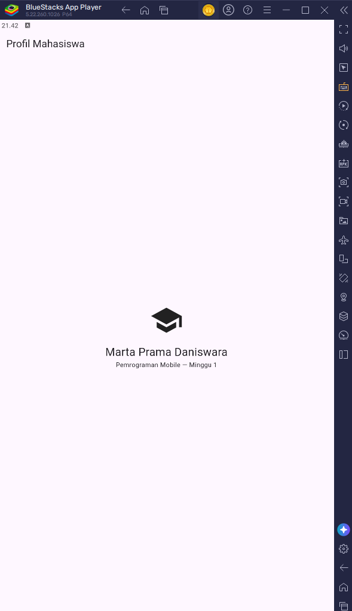
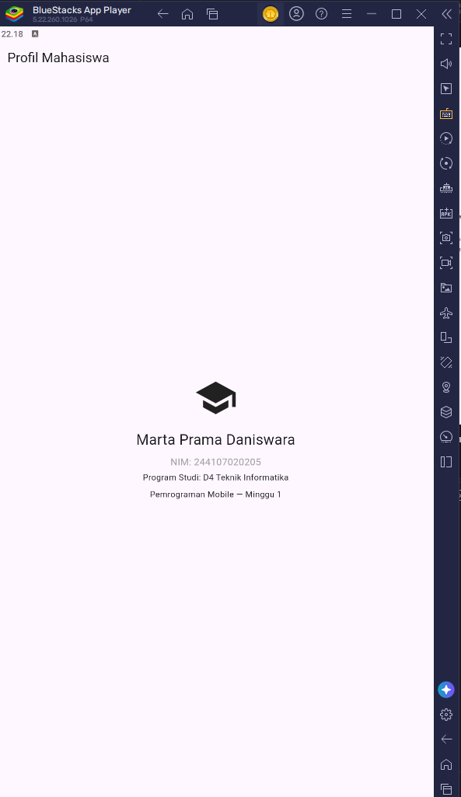

# LAPORAN PRAKTIKUM JOBSHEET-01

Tampilan Aplikasi Flutter

<table>
  <tr>
    <td align="center">
       
      <b>Aplikasi Flutter Pertama</b>
    </td>
    <td align="center">
       
      <b>Mini Assignment</b> 
      <i>Catatan: menambahkan NIM dan program studi.</i>
    </td>
  </tr>
</table>