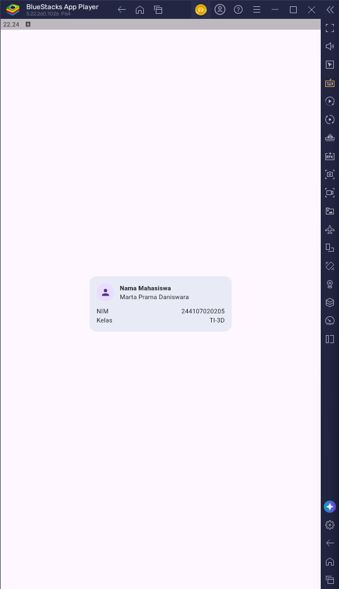
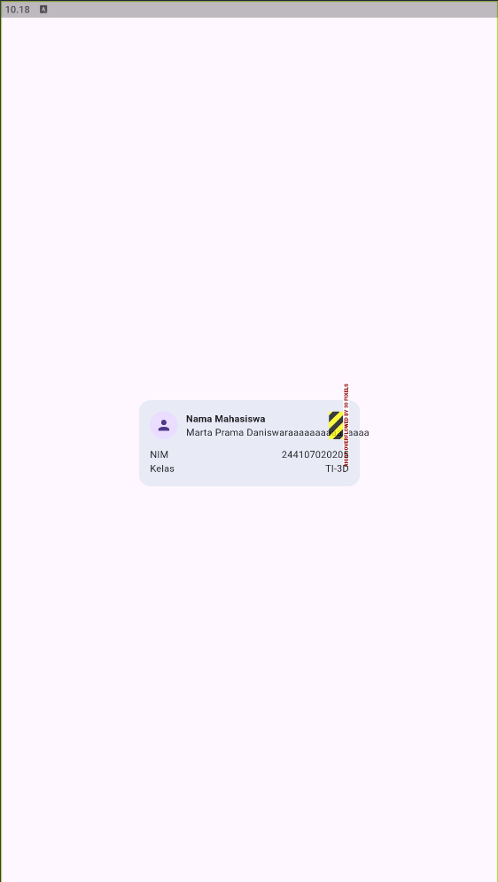
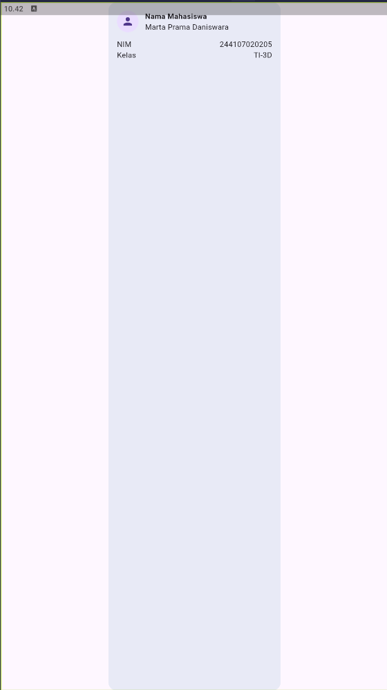
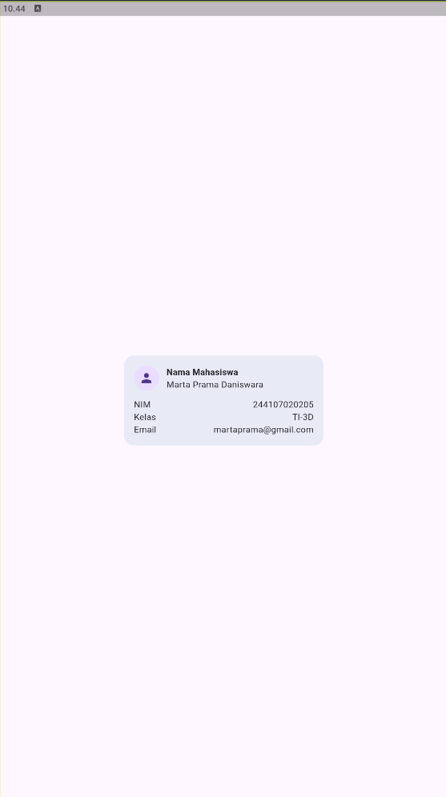

# LAPORAN PRAKTIKUM JOBSHEET-02

Praktikum: layout sederhana (warm-up)

  

### Eksperimen warm-up

1. Hapus Expanded pada baris nama, lalu amati peringatan overflow atau perilaku layout-nya; kembalikan setelah itu.

  

<i>Hasil: Tanpa Expanded, Column hanya mengambil ruang sesuai ukuran kontennya. Jika teks terlalu panjang, teks dapat menyebabkan overflow karena tidak memiliki ruang fleksibel untuk menyesuaikan diri.</i>

2. Ganti mainAxisSize: MainAxisSize.min menjadi nilai default dan amati perubahan tinggi kartu.

  

<i>Hasil: Secara default, Column menggunakan MainAxisSize.max, sehingga Column akan berusaha mengambil ruang vertikal yang tersedia. Akibatnya, tinggi kartu dapat menjadi lebih besar dibandingkan saat menggunakan MainAxisSize.min.</i>

3. Tambahkan satu baris data (misal Email) menggunakan pola Row + Expanded yang sama.

  

