# Praktikum: dashboard responsif

<p align="center">
  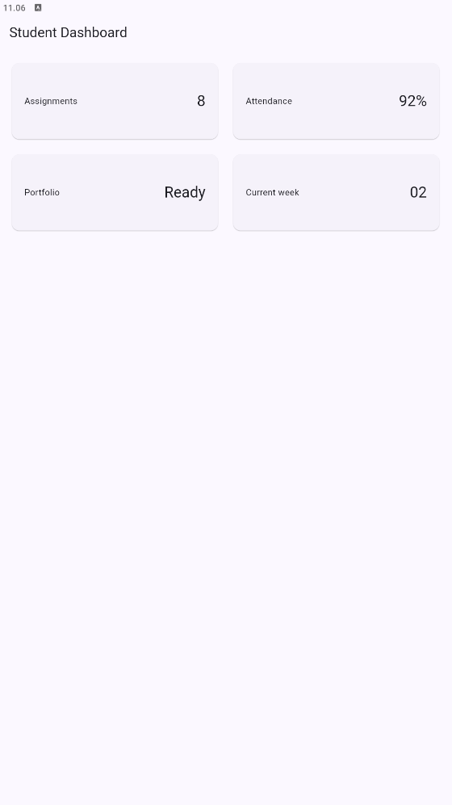
</p>

## Menambahkan interaksi: StatefulWidget dan Cupertino

<table>
  <tr>
    <td align="center">
      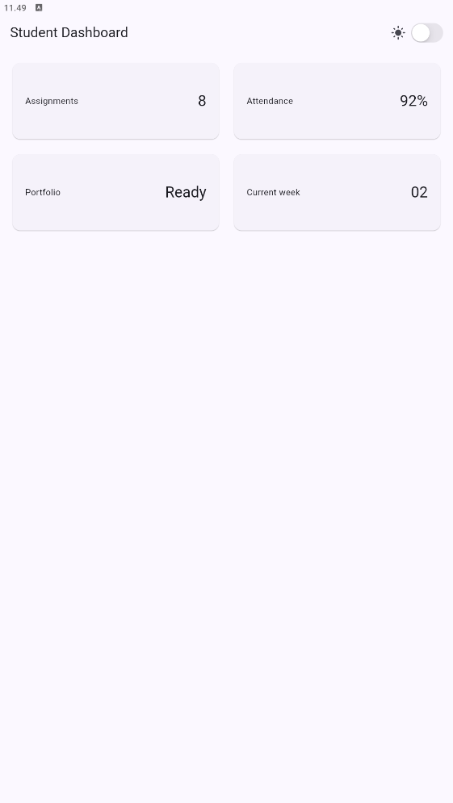
    </td>
    <td align="center">
      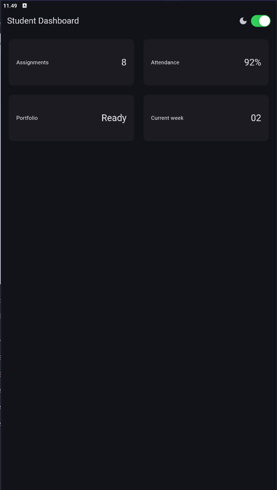
    </td>
  </tr>
</table>

### Eksperimen warm-up

1. Ubah breakpoint dari `700` menjadi nilai lain dan amati perubahan jumlah kolom.

<p align="center">
  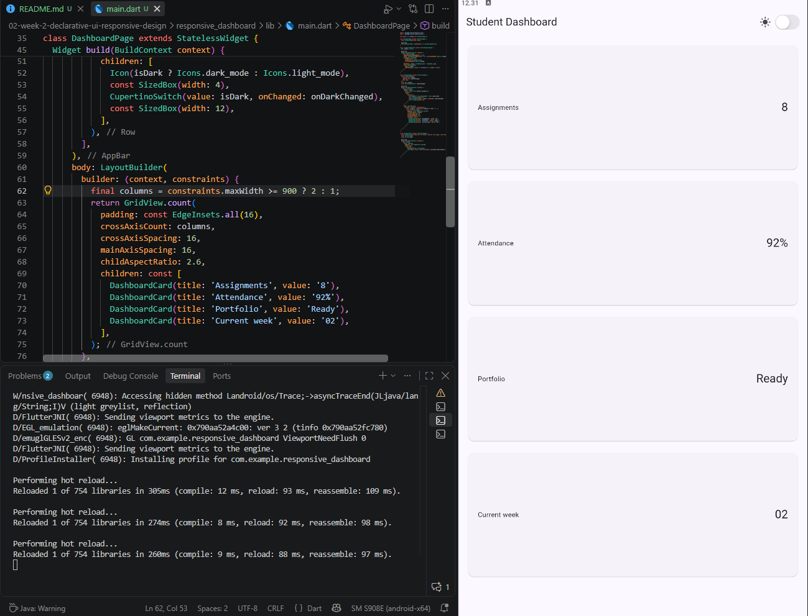
</p>

> **Hasil:** Breakpoint diubah dari `700` menjadi `900`. Breakpoint `700` menentukan kapan dashboard berubah dari satu kolom menjadi dua kolom. Jika diubah menjadi `900`, layar dengan lebar 700-899 piksel tetap menggunakan satu kolom. Dua kolom baru ditampilkan pada layar dengan lebar minimal 900 piksel.

2. Ubah `themeMode` menjadi `ThemeMode.dark`, lalu kembalikan ke `ThemeMode.system`.

#### Ketika Diubah Menjadi `ThemeMode.dark`

<p align="center">
  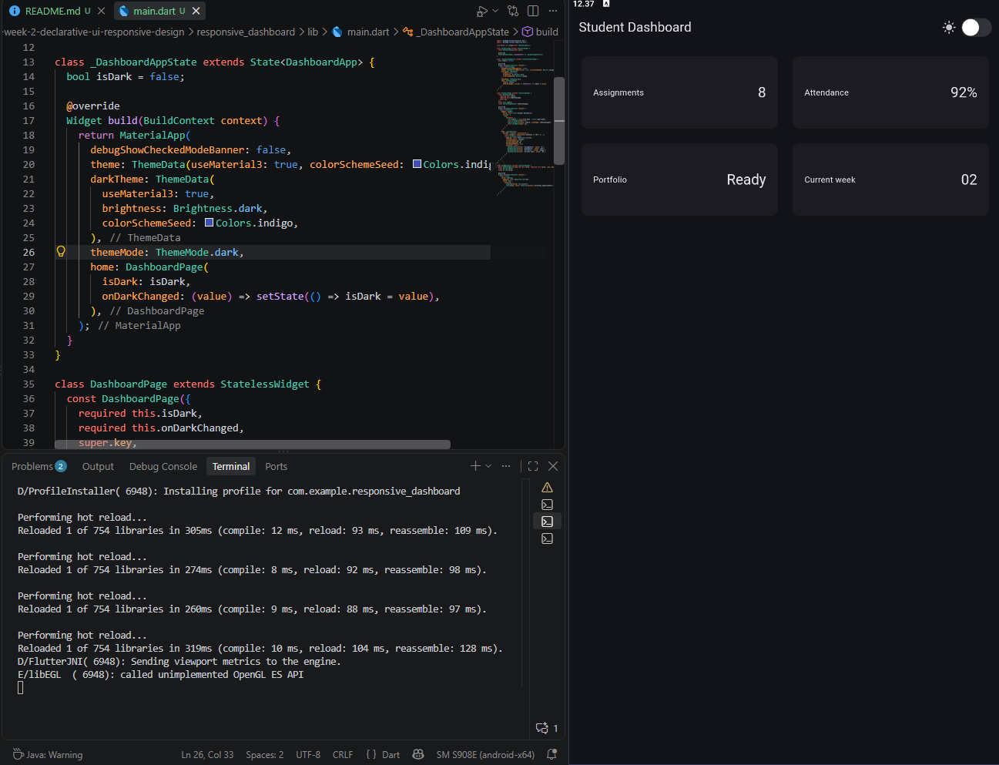
</p>

> **Hasil:** Tampilan aplikasi akan selalu menggunakan Dark Mode, meskipun `isDark` bernilai `false` dan switch berada dalam kondisi terang.

#### Ketika Dikembalikan Menjadi `ThemeMode.system`

<p align="center">
  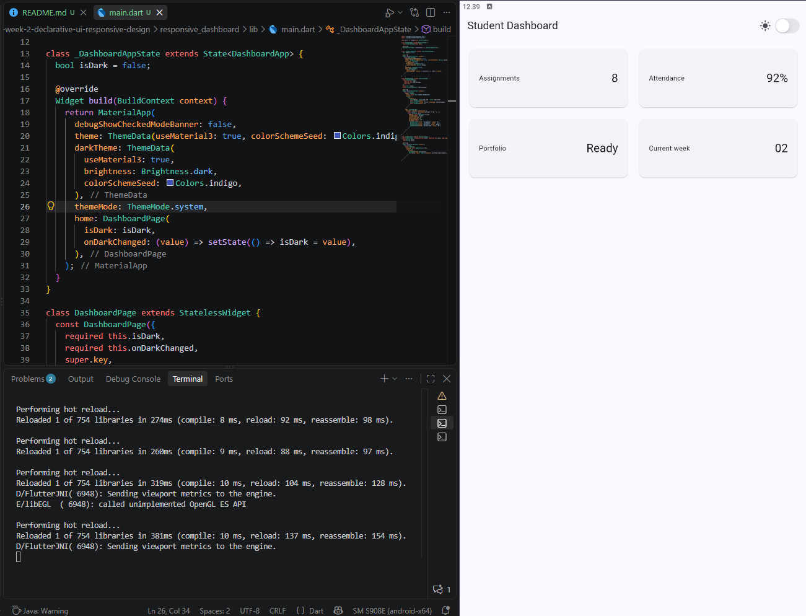
</p>

> **Hasil:** Tema aplikasi akan mengikuti pengaturan tema perangkat atau emulator.

3. Uji aplikasi dengan ukuran layar emulator yang berbeda.

<table>
  <tr>
    <td align="center">
      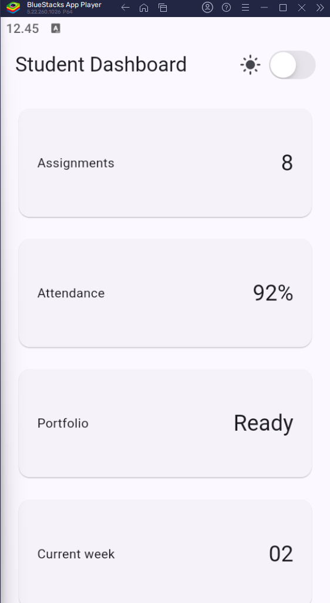<br>
      <b>540 x 960 px</b>
    </td>
    <td align="center">
      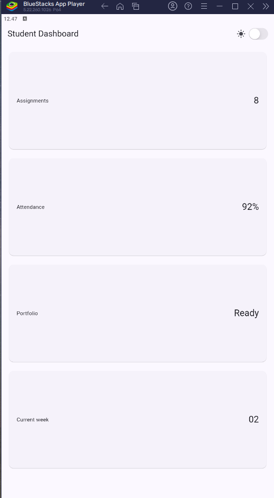<br>
      <b>1080 x 1920 px</b><br>
    </td>
    <td align="center">
      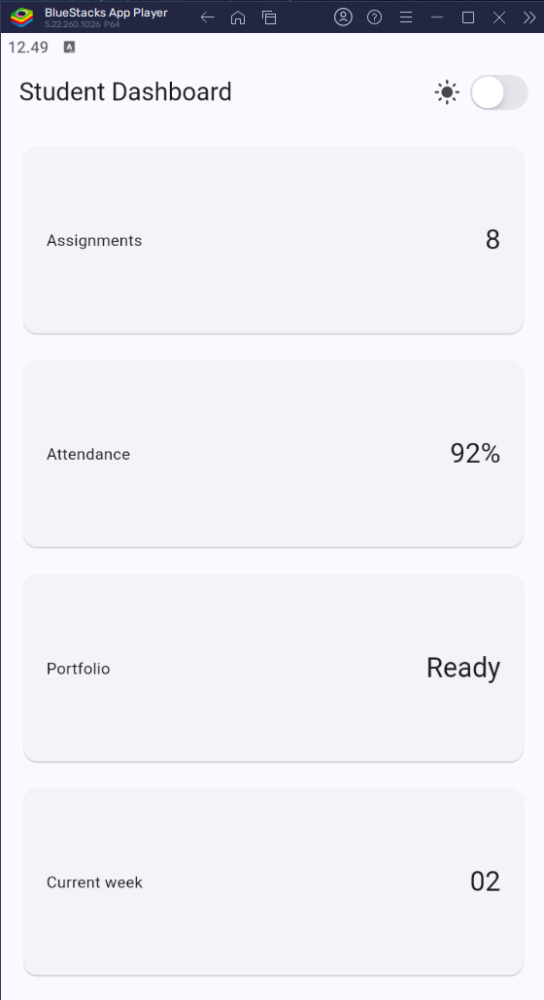<br>
      <b>720 x 1280 px</b>
    </td>
  </tr>
  <tr>
    <td align="center">
      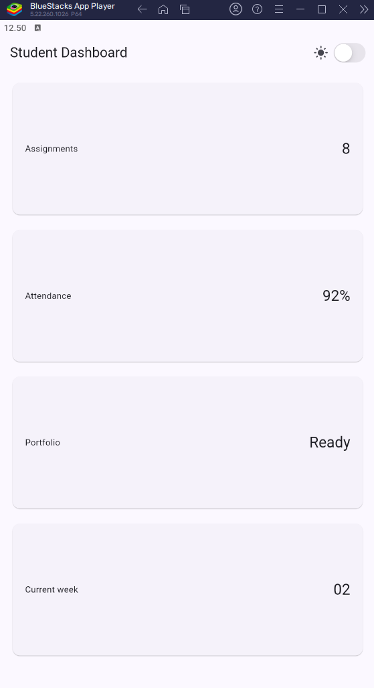<br>
      <b>900 x 1600 px</b>
    </td>
    <td align="center">
      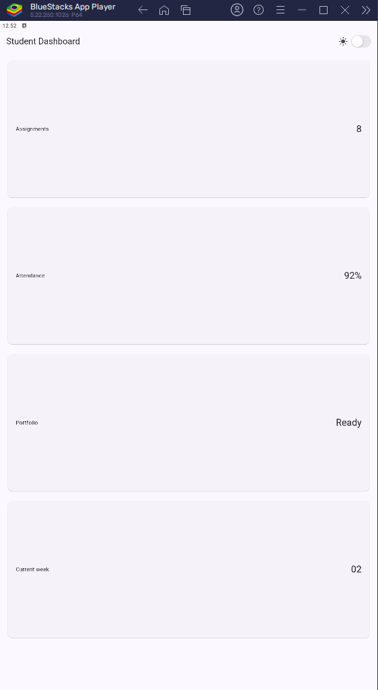<br>
      <b>1440 x 2560 px</b>
    </td>
    <td></td>
  </tr>
</table>

> **Hasil:** Setelah diuji pada beberapa ukuran layar emulator, aplikasi dapat menyesuaikan jumlah kolom berdasarkan lebar layar. Jika lebar layar kurang dari 700 px, dashboard menampilkan satu kolom. Jika lebar layar 700 px atau lebih, dashboard menampilkan dua kolom. Hal ini menunjukkan bahwa `LayoutBuilder` membuat tampilan aplikasi responsif terhadap ukuran layar.

4. Tambahkan `Semantics` atau label yang bermakna pada elemen penting bagi screen reader.

<table>
  <tr>
    <td align="center">
      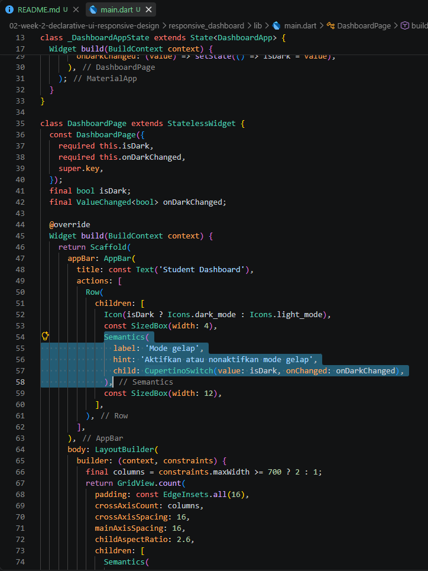<br>
      <b>Menambahkan Semantics pada Dark Mode Switch</b>
    </td>
    <td align="center">
      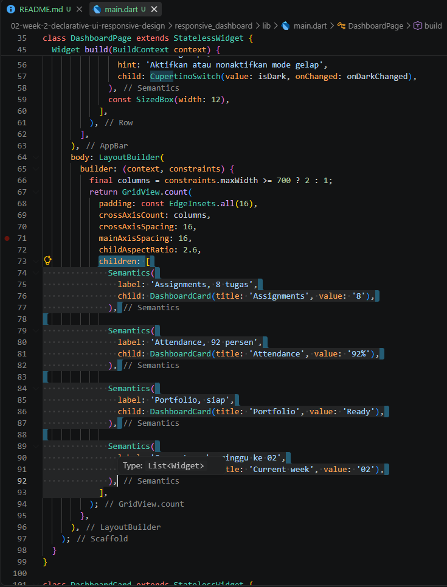<br>
      <b>Menambahkan Semantics pada DashboardCard</b>
    </td>
  </tr>
</table>

# Tugas dan AI design exploration

## Tugas utama

<table>
  <tr>
    <td align="center">
      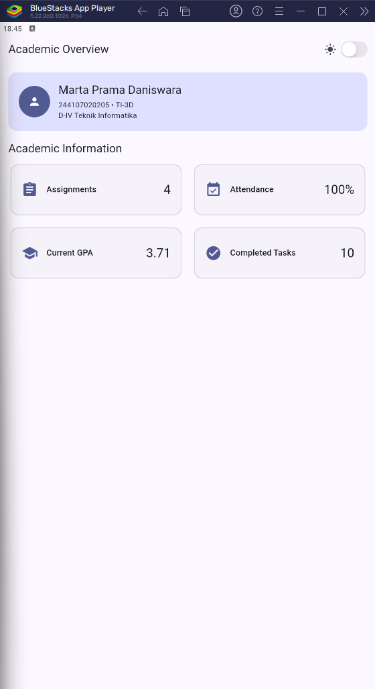<br>
      <b>Screenshot layar lebar</b>
    </td>
    <td align="center">
      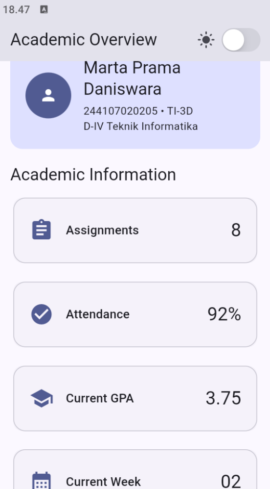<br>
      <b>Screenshot layar sempit</b>
    </td>
  </tr>
</table>

## AI Prompt Challange

1. Perbandingan Tata Letak Dashboard

| Aspek | `GridView` | `LayoutBuilder` + `Column` |
|---|---|---|
| **Kegunaan** | Cocok untuk banyak kartu yang seragam. | Cocok untuk dashboard dengan header, section, dan kartu informasi. |
| **Responsivitas** | Breakpoint terutama digunakan untuk mengubah jumlah kolom. | Breakpoint dapat mengubah jumlah kolom, ukuran kartu, padding, dan susunan komponen. |
| **Struktur layout** | Sederhana, tetapi kurang fleksibel untuk beberapa bagian halaman. | Lebih fleksibel karena elemen dapat disusun secara vertikal dan berkelompok. |
| **Scrolling** | `GridView` sudah menangani scrolling. | Membutuhkan `SingleChildScrollView`; grid di dalamnya perlu `shrinkWrap` dan physics yang sesuai. |
| **Kompleksitas kode** | Lebih singkat dan mudah dipelihara untuk layout sederhana. | Lebih panjang, tetapi lebih mudah dikembangkan untuk dashboard kompleks. |
| **Performa** | Efisien untuk daftar item yang banyak karena mendukung lazy rendering. | Cocok untuk jumlah item terbatas; `shrinkWrap` dapat menambah beban jika item sangat banyak. |
| **Aksesibilitas kartu** | Perlu `Semantics` agar setiap kartu dibaca dengan label yang jelas. | Juga perlu `Semantics`; urutan pembacaan biasanya lebih terstruktur mengikuti susunan halaman. |
| **Aksesibilitas kontrol** | Dapat menggunakan label dan hint pada switch atau kontrol lainnya. | Dapat menggunakan label dan hint yang sama, misalnya pada `CupertinoSwitch`. |
| **Pilihan terbaik** | Dashboard sederhana dengan kartu seragam. | Dashboard akademik dengan beberapa section dan kebutuhan responsif yang lebih kompleks. |

**Kesimpulan:** `GridView` lebih praktis untuk dashboard sederhana, sedangkan `LayoutBuilder` + `Column` lebih fleksibel untuk dashboard akademik yang memiliki struktur kompleks. Keduanya tetap memerlukan `Semantics`, label yang jelas, urutan widget yang logis, kontras warna yang baik, dan ukuran teks yang mudah dibaca agar aksesibel.

2. Penggunaan `Expanded` di Dalam `Row`

`Expanded` dapat menyebabkan overflow jika child lain di dalam `Row` terlalu lebar dan tidak bisa mengecil.

Contoh yang menyebabkan overflow:

```dart
SizedBox(
  width: 300,
  child: Row(
    children: [
      Expanded(
        child: Text(
          'Judul tugas yang panjang',
          maxLines: 1,
          overflow: TextOverflow.ellipsis,
        ),
      ),
      const Text('Keterangan tambahan yang sangat panjang'),
    ],
  ),
)
```

Teks kedua tidak fleksibel sehingga total lebar child melebihi lebar `Row` dan muncul overflow.

Perbaikannya:

```dart
SizedBox(
  width: 300,
  child: Row(
    children: [
      Expanded(
        child: Text(
          'Judul tugas yang panjang',
          maxLines: 1,
          overflow: TextOverflow.ellipsis,
        ),
      ),
      const SizedBox(width: 8),
      Flexible(
        child: Text(
          'Keterangan tambahan yang sangat panjang',
          maxLines: 1,
          overflow: TextOverflow.ellipsis,
        ),
      ),
    ],
  ),
)
```

`Flexible` memberi batas agar teks kedua dapat mengecil, sedangkan `TextOverflow.ellipsis` mencegah teks keluar dari `Row`. Hindari `Expanded` pada `Row` dengan lebar tak terbatas, seperti di dalam scroll horizontal.

3. Pemeriksaan Ulang Rekomendasi Layout

| Pemeriksaan | Hasil |
|---|---|
| Responsif di bawah 600 px | Tetap responsif. `LayoutBuilder` memilih satu kolom karena lebar layar masih di bawah breakpoint 700 px. `SingleChildScrollView` memungkinkan halaman digulir secara vertikal. |
| Risiko layout sempit | Header profil masih dapat menyesuaikan karena teks memakai `Expanded`, tetapi judul AppBar dan kontrol switch perlu diuji pada layar sangat sempit. Teks panjang sebaiknya memakai `maxLines` dan `TextOverflow.ellipsis` jika diperlukan. |
| Aksesibilitas | Tidak berkurang selama `Semantics` dipertahankan. Label kartu dan label/hint switch membantu screen reader. Pastikan kontras warna, ukuran teks, dan urutan pembacaan tetap baik. |
| Widget Flutter stable | `LayoutBuilder`, `Column`, `GridView.count`, `SingleChildScrollView`, `Semantics`, `Expanded`, `Flexible`, dan `CupertinoSwitch` tersedia di Flutter stable. Tidak ada widget eksperimental yang digunakan. |
| Rekomendasi akhir | Gunakan `LayoutBuilder` + `Column` untuk dashboard ini. Gunakan `GridView` langsung jika halaman hanya berisi kumpulan kartu yang seragam. |

**Kesimpulan:** Layout tetap responsif di bawah 600 px dan tidak mengurangi aksesibilitas jika label `Semantics` serta batas teks dipertahankan. Widget yang digunakan kompatibel dengan Flutter stable.

## Refactoring Challange

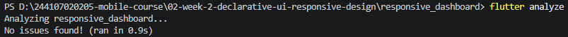<br>
Menjalankan flutter analyze dan berhasil.

## Testing Challange
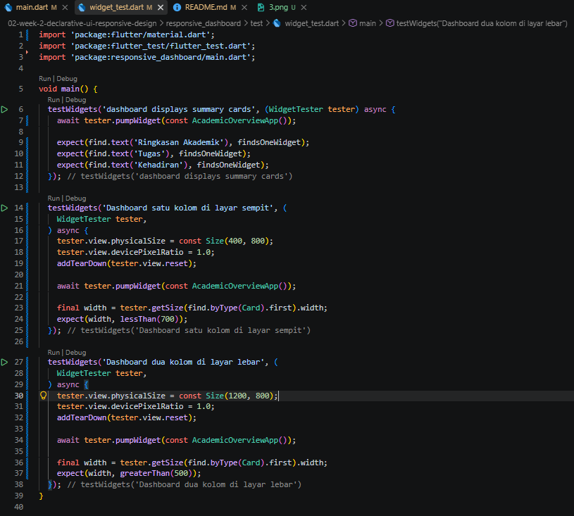<br>
Menambahkan widget test di folder test/ untuk memverifikasi perilaku responsif.

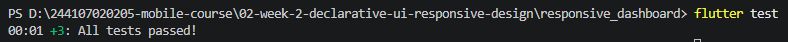<br>
Menjalankan flutter test' dan berhasil.