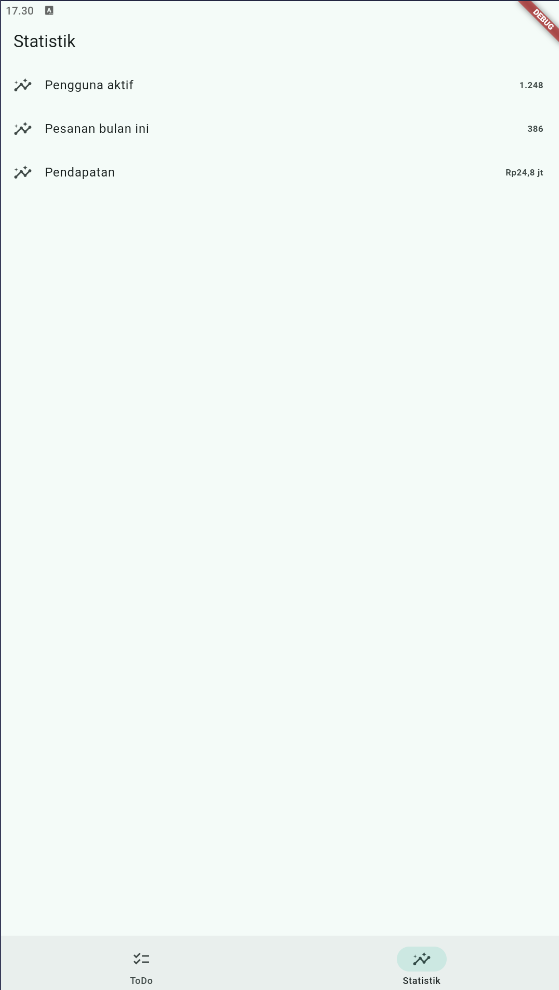

# Praktikum 3 - Pengujian Tiga State

1. Salin kode di atas ke project ToDo Anda atau project terpisah, lalu jalankan. Amati tampilan loading selama 2 detik pertama.

2. Ubah `build()` sementara agar melempar error:

  ```dart
  throw Exception('Gagal terhubung ke server');
  ```

  Jalankan aplikasi dan amati UI error beserta tombol `Coba lagi`.

  **Jawaban:** Tombol `Coba lagi` belum dapat ditekan otomatis karena Flutter Driver Extension belum aktif. Namun, handler tombol sudah terpasang melalui `ref.invalidate(productsProvider)`.

<p align="center">
  
</p>

3. Tekan tombol `Coba lagi`. `ref.invalidate` akan menjalankan ulang provider. Pulihkan kode, lalu pastikan state success tampil.

  **Jawaban:** State success berhasil tampil dengan daftar produk Keyboard, Mouse, dan Monitor.

<p align="center">
  
</p>

4. Refleksikan: Mengapa menampilkan ulang data lama (stale data) dengan indikator refresh kadang lebih baik daripada mengosongkan layar? Kapan pola tersebut penting?

  **Jawaban:** Menampilkan data lama dengan indikator refresh lebih baik karena layar tetap berguna dan tidak kosong saat menunggu data baru.

  Pola ini penting untuk dashboard, daftar produk, feed, dan aplikasi dengan koneksi lambat. Namun, data lama sebaiknya tidak digunakan untuk informasi kritis seperti saldo, pembayaran, atau stok real-time.


# 5. AI Challange

Penjelasan setiap bagian kode dalam komentar:
- stats_provider.dart: StatsNotifier, delay 2 detik, peluang gagal 30%, dan satu statsProvider.
- stats_page.dart: menangani loading, error + retry, dan success dengan 3 item ListView.
- main.dart: StatsPage dijadikan halaman utama.
- stats_provider_test.dart: unit test sukses dan gagal.
- widget_test.dart: diperbarui untuk Riverpod.

### AI Verification Checklist

| Pemeriksaan | Temuan | Status |
|---|---|---|
| State immutable | Tidak ditemukan `state.add()` atau mutasi list langsung. `TodoListNotifier` membuat salinan dengan spread operator, lalu melakukan assignment ke `state`; `StatsNotifier` mengembalikan list baru. | LULUS |
| `ref.watch` dan `ref.read` | `ref.watch` hanya digunakan di dalam `build`. Callback retry memakai `ref.invalidate`, sedangkan callback ToDo memakai `ref.read` untuk memanggil notifier. | LULUS |
| Tiga state `AsyncValue` | `StatsPage` menangani `loading` dengan spinner, `error` dengan pesan dan tombol retry, serta `data` dengan `ListView` berisi tiga item. | LULUS |
| Provider eksplisit dan unik | `statsProvider` bertipe `AsyncNotifierProvider<StatsNotifier, List<Statistic>>`; provider lain (`productsProvider` dan `todoListProvider`) memiliki nama serta tipe berbeda dan tidak duplikat. | LULUS |
| API Riverpod lama atau antipattern | Tidak ditemukan `StateProvider`, `StateNotifierProvider`, atau `Consumer` bertingkat yang tidak perlu. Implementasi memakai `AsyncNotifier`, `Notifier`, dan `ConsumerWidget`. | LULUS |
| `flutter analyze` | `No issues found!` | LULUS |
| `flutter test` | `00:01 +3: All tests passed!` | LULUS |

Kesimpulan: kode memenuhi seluruh pemeriksaan di atas dan dapat diterima berdasarkan audit statis serta hasil test pada 12 September 2026.


Tampilan akhir
<p align="center">
  
</p>
