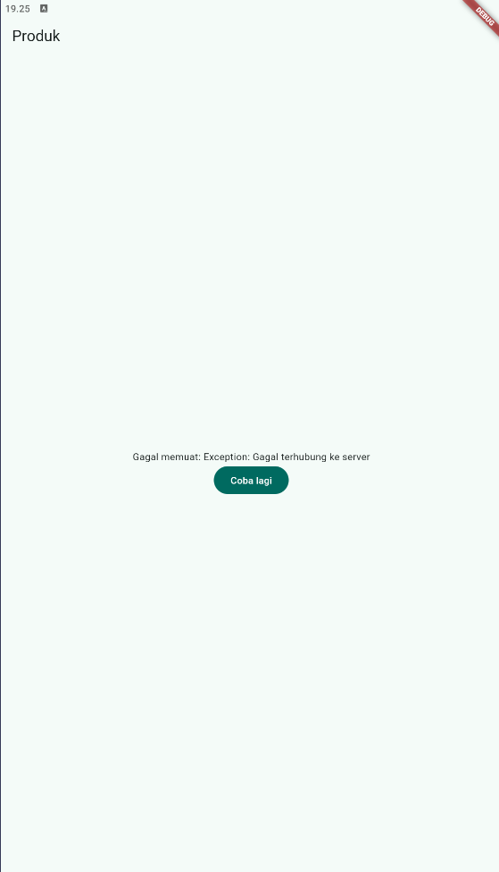
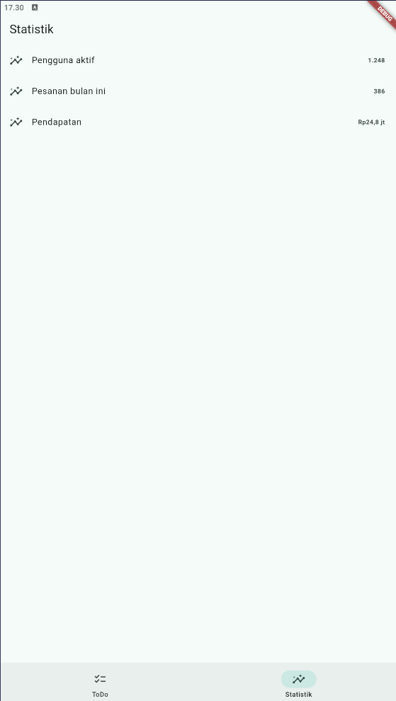

# Praktikum 3 - Pengujian Tiga State

1. Salin kode di atas ke project ToDo Anda atau project terpisah, lalu jalankan. Amati tampilan loading selama 2 detik pertama.

2. Ubah `build()` sementara agar melempar error:

  ```dart
  throw Exception('Gagal terhubung ke server');
  ```

  Jalankan aplikasi dan amati UI error beserta tombol `Coba lagi`.

  **Jawaban:** Tombol `Coba lagi` belum dapat ditekan otomatis karena Flutter Driver Extension belum aktif. Namun, handler tombol sudah terpasang melalui `ref.invalidate(productsProvider)`.

<p align="center">
  
</p>

3. Tekan tombol `Coba lagi`. `ref.invalidate` akan menjalankan ulang provider. Pulihkan kode, lalu pastikan state success tampil.

  **Jawaban:** State success berhasil tampil dengan daftar produk Keyboard, Mouse, dan Monitor.

<p align="center">
  
</p>

4. Refleksikan: Mengapa menampilkan ulang data lama (stale data) dengan indikator refresh kadang lebih baik daripada mengosongkan layar? Kapan pola tersebut penting?

  **Jawaban:** Menampilkan data lama dengan indikator refresh lebih baik karena layar tetap berguna dan tidak kosong saat menunggu data baru.

  Pola ini penting untuk dashboard, daftar produk, feed, dan aplikasi dengan koneksi lambat. Namun, data lama sebaiknya tidak digunakan untuk informasi kritis seperti saldo, pembayaran, atau stok real-time.


# 5. AI Challange

Penjelasan setiap bagian kode dalam komentar:
- stats_provider.dart: StatsNotifier, delay 2 detik, peluang gagal 30%, dan satu statsProvider.
- stats_page.dart: menangani loading, error + retry, dan success dengan 3 item ListView.
- main.dart: StatsPage dijadikan halaman utama.
- stats_provider_test.dart: unit test sukses dan gagal.
- widget_test.dart: diperbarui untuk Riverpod.

### AI Verification Checklist

| Pemeriksaan | Temuan | Status |
|---|---|---|
| State immutable | Tidak ditemukan `state.add()` atau mutasi list langsung. `TodoListNotifier` membuat salinan dengan spread operator, lalu melakukan assignment ke `state`; `StatsNotifier` mengembalikan list baru. | LULUS |
| `ref.watch` dan `ref.read` | `ref.watch` hanya digunakan di dalam `build`. Callback retry memakai `ref.invalidate`, sedangkan callback ToDo memakai `ref.read` untuk memanggil notifier. | LULUS |
| Tiga state `AsyncValue` | `StatsPage` menangani `loading` dengan spinner, `error` dengan pesan dan tombol retry, serta `data` dengan `ListView` berisi tiga item. | LULUS |
| Provider eksplisit dan unik | `statsProvider` bertipe `AsyncNotifierProvider<StatsNotifier, List<Statistic>>`; provider lain (`productsProvider` dan `todoListProvider`) memiliki nama serta tipe berbeda dan tidak duplikat. | LULUS |
| API Riverpod lama atau antipattern | Tidak ditemukan `StateProvider`, `StateNotifierProvider`, atau `Consumer` bertingkat yang tidak perlu. Implementasi memakai `AsyncNotifier`, `Notifier`, dan `ConsumerWidget`. | LULUS |
| `flutter analyze` | `No issues found!` | LULUS |
| `flutter test` | `00:01 +3: All tests passed!` | LULUS |

Kesimpulan: kode memenuhi seluruh pemeriksaan di atas dan dapat diterima berdasarkan audit statis serta hasil test pada 12 September 2026.


Tampilan akhir
<p align="center">
  
</p>


# ToDo Navigation & Riverpod

Mini project minggu ke-3 untuk membangun aplikasi ToDo Flutter dengan navigasi multi-halaman dan state management Riverpod.

## Tujuan

- Memisahkan alur daftar tugas dan ringkasan aplikasi ke dalam dua halaman.
- Mengelola state ToDo secara immutable menggunakan `Notifier`.
- Mempraktikkan state asinkron `loading`, `error`, dan `success` dengan `AsyncNotifier` serta `AsyncValue`.
- Menulis unit test dan widget test untuk memvalidasi perilaku aplikasi.

## Fitur Utama

- **Daftar ToDo**: menambah, menandai selesai, dan menghapus tugas.
- **Navigasi**: berpindah antara halaman ToDo dan Statistik melalui `GoRouter` serta `NavigationBar`.
- **Statistik asinkron**: simulasi pengambilan data selama dua detik.
- **Error dan retry**: kegagalan simulasi ditampilkan bersama tombol **Coba lagi**.
- **State reaktif**: UI dibangun dengan `ConsumerWidget` dan bereaksi terhadap perubahan provider.

## Stack Teknologi

- Flutter / Dart
- `flutter_riverpod` 3.x
- `go_router` 16.x
- `flutter_test`

## Struktur Proyek

```text
lib/
  main.dart
  pages/
    todo_page.dart
    stats_page.dart
  providers/
    todo_provider.dart
    stats_provider.dart
  widgets/
    todo_tile.dart
test/
  todo_provider_test.dart
  stats_provider_test.dart
  widget_test.dart
screenshots/
```

## Cara Menjalankan

Dari folder `03-week-3-navigation-state-management/week3_todo`:

```bash
flutter pub get
flutter run
```

Untuk menjalankan pemeriksaan kualitas:

```bash
flutter analyze
flutter test
```

## Hasil yang Dicapai

- Aplikasi memiliki dua halaman yang dapat dinavigasikan tanpa kehilangan state daftar tugas.
- State daftar ToDo dikelola immutable melalui `TodoListNotifier`.
- Halaman Statistik menampilkan tiga state `AsyncValue` secara eksplisit: indikator loading, pesan error dengan retry, dan daftar data saat sukses.
- Seluruh 6 unit/widget test lulus pada validasi terakhir.

## AI Challenge

### Prompt

> Audit aplikasi Flutter ToDo minggu ke-3. Pastikan aplikasi menggunakan minimal dua halaman dengan GoRouter, state ToDo menggunakan Riverpod `Notifier`, UI menggunakan `ConsumerWidget`, simulasi statistik menampilkan state loading/error/success dengan `AsyncValue`, dan tersedia unit/widget test. Jelaskan temuan, risiko, serta perbaikan yang diperlukan.

### Hasil AI

Audit menyimpulkan bahwa struktur provider sudah sesuai pola Riverpod modern. `TodoListNotifier` membuat list baru setiap perubahan, sedangkan `StatsNotifier` mengembalikan `Future<List<Statistic>>` sehingga Riverpod mengelola `AsyncValue`. Halaman Statistik menangani ketiga state dan menyediakan aksi invalidasi provider untuk retry. Test mencakup penambahan tugas, halaman awal, navigasi statistik, provider sukses, dan provider gagal.

### Perbaikan dan Keputusan Teknis

- README lama berisi catatan eksperimen produk dan belum menjadi dokumentasi mini project, sehingga diganti dengan dokumentasi fitur, setup, struktur, hasil, dan AI Challenge.
- `AsyncNotifier` dipilih daripada mengelola boolean loading/error secara manual karena status asinkron menjadi satu kontrak state yang konsisten.
- `Notifier<List<Todo>>` dipilih untuk operasi lokal yang sinkron. Setiap operasi menyalin list sebelum assignment agar state tidak dimutasi langsung.
- `StatefulShellRoute.indexedStack` dipakai agar perpindahan tab tetap mempertahankan state halaman.
- Delay dan peluang error statistik sengaja dipertahankan sebagai simulasi agar tiga keadaan asinkron dapat diamati dan diuji.

## Refleksi Praktikum: Pengujian Tiga State

### 1. State Loading

Saat halaman Statistik dibuka, aplikasi menjalankan simulasi pengambilan data selama dua detik. Selama proses tersebut, `AsyncValue.loading` ditampilkan sebagai `CircularProgressIndicator`.

### 2. State Error

Untuk menguji kondisi error, peluang kegagalan pada `StatsNotifier` dapat dibuat selalu gagal. Aplikasi kemudian menampilkan pesan:

```dart
throw Exception('Server statistik tidak dapat dihubungi.');
```

UI error menyediakan tombol **Coba lagi**. Tombol tersebut memanggil `ref.invalidate(statsProvider)` agar provider dijalankan ulang. Pada pengujian, `failureRoll` digunakan supaya kondisi sukses dan gagal dapat dibuat deterministik tanpa menunggu atau bergantung pada angka acak.

### 3. State Success

Setelah pengambilan data berhasil, halaman Statistik menampilkan tiga data:

- Pengguna aktif: 1.248
- Pesanan bulan ini: 386
- Pendapatan: Rp24,8 jt

### 4. Refleksi Stale Data

Menampilkan data lama dengan indikator refresh sering lebih baik daripada mengosongkan layar karena pengguna tetap dapat membaca informasi yang tersedia selama data baru dimuat. Pola ini penting untuk dashboard, daftar produk, feed, dan aplikasi dengan koneksi lambat. Namun, data lama sebaiknya tidak dijadikan dasar untuk informasi kritis seperti saldo, pembayaran, atau stok real-time.

## AI Verification Checklist

| Pemeriksaan | Temuan | Status |
|---|---|---|
| State immutable | `TodoListNotifier` membuat salinan list dengan spread operator sebelum assignment. Tidak ada mutasi langsung pada `state`. | LULUS |
| `ref.watch` dan `ref.read` | `ref.watch` digunakan di `build`, sedangkan callback memakai `ref.read` atau `ref.invalidate` sesuai kebutuhan. | LULUS |
| Tiga state `AsyncValue` | `StatsPage` menangani loading dengan spinner, error dengan pesan dan retry, serta data dengan daftar statistik. | LULUS |
| Provider eksplisit dan unik | `statsProvider`, `todoListProvider`, dan `incompleteTodosProvider` memiliki nama serta tipe yang berbeda. | LULUS |
| API Riverpod modern | Implementasi menggunakan `Notifier`, `AsyncNotifier`, dan `ConsumerWidget` tanpa `StateProvider` atau `StateNotifierProvider`. | LULUS |
| `flutter analyze` | Tidak ditemukan issue. | LULUS |
| `flutter test` | Seluruh 6 test lulus. | LULUS |

### Kesimpulan AI Challenge

Hasil audit statis dan pengujian menunjukkan bahwa aplikasi memenuhi persyaratan navigasi, state management Riverpod, simulasi asinkron, dokumentasi, dan testing untuk tugas minggu ke-3.

## Referensi

- [Flutter navigation and routing](https://docs.flutter.dev/ui/navigation)
- [Riverpod providers](https://riverpod.dev/docs/concepts2/providers)
- [Riverpod asynchronous providers](https://riverpod.dev/docs/concepts2/async)
- [GoRouter package](https://pub.dev/packages/go_router)

## Screenshots

| Daftar ToDo | Statistik | Hasil akhir |
|---|---|---|
|  |  |  |
