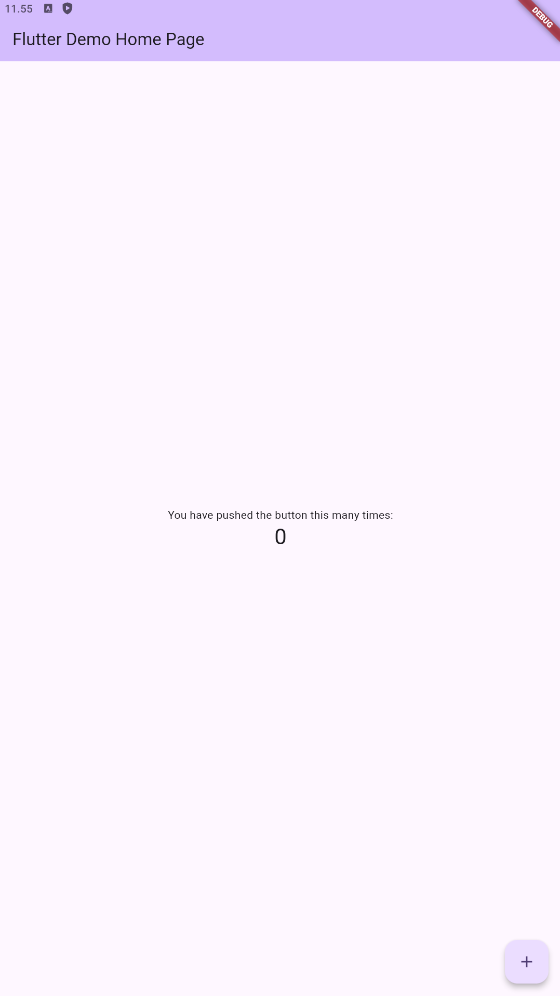
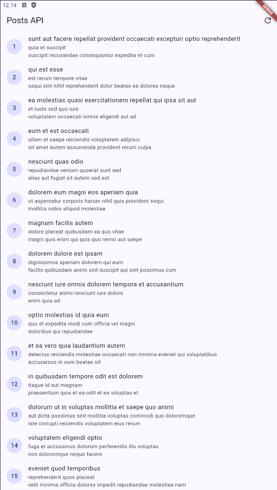
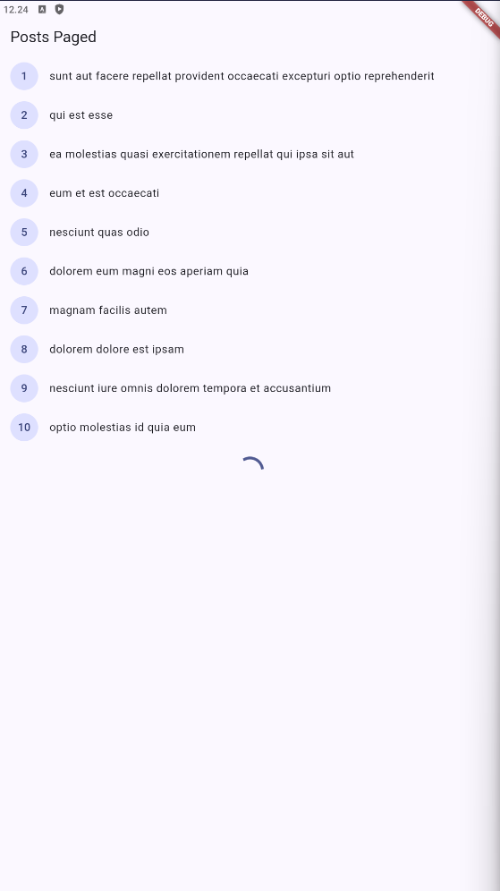

# Praktikum 1: Dio dan model data

  

# Praktikum 2: Provider dan error handling

  

# Praktikum 3: Pagination dasar

### Ubah home di main.dart menjadi PagedPostPage, jalankan, dan scroll sampai bawah. Amati: halaman 1 tampil dulu, indikator muncul, data bertambah tanpa reload penuh.

Hasil pengecekan:
- flutter analyze: tidak ada error.
= Aplikasi berhasil berjalan di emulator Android.
= Halaman pertama berhasil mengambil 10 data dengan status 200.
- Listener scroll dan indikator loading sudah tersedia di paged_post_page.dart.
- Data halaman berikutnya dipanggil melalui loadNextPage() tanpa reload penuh.

  

# Verifikasi AI

Dokumentasi prompt, output awal AI, perbaikan, penjelasan kode, dan hasil
testing tersedia di folder [`docs/`](docs/).

Checklist:

- UI tidak memanggil Dio secara langsung; request komentar melewati `CommentRepository` melalui provider.
- `Comment.fromJson` aman terhadap field hilang dan `null`, dengan default `0` atau string kosong.
- Timeout, `connectionError`, dan `badResponse` (termasuk 404 dan 500) dipetakan oleh `friendlyErrorMessage`.
- `baseUrl`, `connectTimeout`, dan `receiveTimeout` terpusat di `data/api_client.dart`.
- Test `fromJson` menguji field hilang/null, bukan hanya happy path.
- `flutter analyze`: lulus tanpa issue.
- `flutter test`: lulus, 2 test passed.