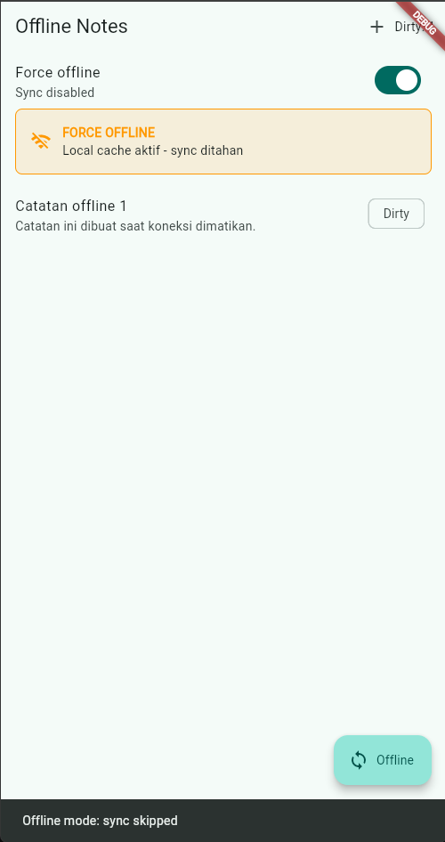
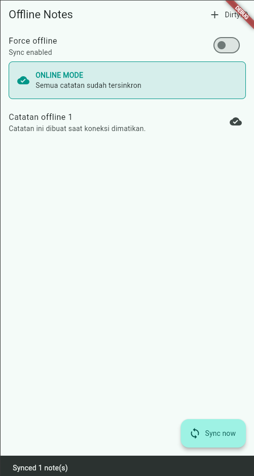

# Praktikum 3: Cache-first dan Sinkronisasi Catatan

## Skenario Verifikasi

1. Tekan tombol `+` di pojok kanan atas.
2. Isi judul dan isi catatan, lalu tekan `Save`.
3. Pastikan catatan tampil dengan status `Dirty`.
4. Aktifkan toggle `Force offline`.
5. Pastikan panel berubah menjadi `FORCE OFFLINE` dan sync ditahan.
6. Tekan `Sync` untuk memastikan muncul pesan `Offline mode: sync skipped`.
7. Matikan toggle `Force offline`.
8. Tekan `Sync now` dan tunggu simulasi upload selama satu detik.
9. Pastikan panel berubah menjadi `ONLINE MODE`, ikon catatan menjadi cloud, dan badge dirty menjadi `0`.

## Hasil Observasi

<table>
  <tr>
    <td align="center">
      <br>
      <b>Gambar 1. Sebelum sync</b><br>
      Force offline aktif, catatan masih <code>Dirty: 1</code>, dan sync ditahan.
    </td>
    <td align="center">
      <br>
      <b>Gambar 2. Sesudah sync</b><br>
      Online mode aktif, catatan sudah tersinkron, dan dirty menjadi <code>0</code>.
    </td>
  </tr>
</table>

| Kondisi | Catatan | Status dirty | Hasil |
| --- | --- | --- | --- |
| Sebelum sync | Tetap tampil dari cache lokal | `Dirty: 1` | Sync dilewati saat offline |
| Sesudah sync | Tetap tampil | `Dirty: 0` | Catatan ditandai synced |

## AI Challenge

Artefak prompt, output awal AI, keputusan storage, dan hasil verifikasi tersedia
di folder [`docs/`](docs/):

- [Prompt AI](docs/ai-challenge-prompt.md)
- [Output awal AI](docs/ai-challenge-initial-output.md)
- [Keputusan storage final](docs/storage-decision.md)
- [Hasil verifikasi](docs/ai-challenge-verification.md)
- [Checklist verifikasi mandiri](docs/self-verification-checklist.md)

## Error Umum dan Solusinya

| Gejala | Penyebab umum | Solusi |
| --- | --- | --- |
| `MissingPluginException` pada `shared_preferences` atau `sqflite` | Plugin baru ditambahkan, tetapi aplikasi hanya di-hot reload atau hot restart | Hentikan aplikasi sepenuhnya, lalu jalankan ulang `flutter run`. |
| `DatabaseException: table notes already exists` | Schema berubah tanpa migrasi atau database development masih memakai versi lama | Naikkan `version` database dan implementasikan `onUpgrade`; saat development, uninstall aplikasi untuk menghapus database lama. |
| Badge dirty tidak pernah menjadi `0` | `markAllSynced()` tidak dipanggil setelah simulasi/server berhasil | Panggil `markAllSynced()` hanya setelah server menjawab sukses, lalu verifikasi dengan `countDirty()`. |
| UI tidak refresh setelah tambah catatan | `notesProvider` tidak di-invalidasi setelah mutasi | Panggil `ref.invalidate(notesProvider)` setelah `addNote()` selesai. |
| Test menyentuh database sungguhan | Test menggunakan `NoteRepository` asli | Gunakan `FakeNoteRepository` dan override `noteRepositoryProvider`, seperti pada [note_test.dart](test/note_test.dart). |

## Refleksi

### 1. Mengapa daftar catatan tidak disimpan di SharedPreferences?

`SharedPreferences` cocok untuk nilai kecil berbentuk key-value, misalnya
`darkMode`. Daftar catatan membutuhkan query, urutan, update sebagian, flag
`dirty`, `updated_at`, dan transaksi. Jika daftar disimpan sebagai satu JSON
besar di `SharedPreferences`, setiap perubahan harus membaca dan menulis ulang
seluruh koleksi. Akibatnya query menjadi tidak efisien, update parsial lebih
rapuh, konflik lebih sulit ditangani, dan data lebih mudah rusak jika proses
berhenti saat penulisan. SharedPreferences juga tidak menyediakan relasi,
index, atau mekanisme migrasi schema seperti SQLite.

### 2. Kapan cache-first cukup?

Cache-first cukup ketika data lokal masih berguna walaupun sedikit stale, misalnya
daftar catatan, profil yang jarang berubah, atau konten yang ingin tetap dapat
dibaca saat offline. Strategi ini membuat UI segera berisi data lalu melakukan
refresh di background.

Untuk data yang harus terbaru sebelum ditampilkan, seperti harga real-time,
saldo, stok, atau status pembayaran, cache-first tidak cukup. Gunakan
network-first atau network-only, tampilkan indikator loading/error, dan gunakan
cache hanya sebagai fallback ketika request gagal.

### 3. Bagaimana dirty flag menjadi antrean sync?

Saat catatan dibuat atau diubah offline, repository menyimpannya dengan
`dirty = 1` dan `updated_at`. UI tetap membaca SQLite sehingga tidak menunggu
network. Ketika koneksi tersedia, proses background menghitung catatan dirty,
mengirimnya ke server, lalu mengubah `dirty` menjadi `0` hanya setelah server
menjawab sukses. Provider kemudian di-invalidasi agar badge dan daftar ikut
menyegarkan.

Implementasi codelab masih memakai `markAllSynced()`, sehingga cocok untuk
simulasi sederhana tetapi belum merupakan antrean penuh. Tabel `outbox` menjadi
perlu jika setiap operasi harus dipertahankan terpisah, misalnya create/update/
delete, perlu retry dengan backoff, idempotency key, status per operasi, payload
request, urutan perubahan, atau penanganan konflik. Contoh kolomnya:

```text
outbox
├── id INTEGER PRIMARY KEY AUTOINCREMENT
├── note_id INTEGER NOT NULL
├── operation TEXT NOT NULL       -- create, update, delete
├── payload TEXT
├── attempts INTEGER NOT NULL DEFAULT 0
├── next_retry_at TEXT
└── created_at TEXT NOT NULL
```

### 4. Rekomendasi AI yang ditolak

Saya menolak rekomendasi implisit untuk menyimpan daftar catatan di
`SharedPreferences`, karena koleksi tersebut memerlukan query dan metadata
sinkronisasi. Saya juga tidak memilih Drift untuk codelab ini walaupun Drift
lebih unggul dalam type-safety, generated query, dan stream. Kebutuhan saat ini
belum memerlukan reactive database stream, sehingga tambahan generator dan
boilerplate Drift lebih besar daripada manfaatnya. Keputusan final tetap
`SharedPreferences` untuk preferensi tema dan SQLite melalui `sqflite` untuk
catatan.

