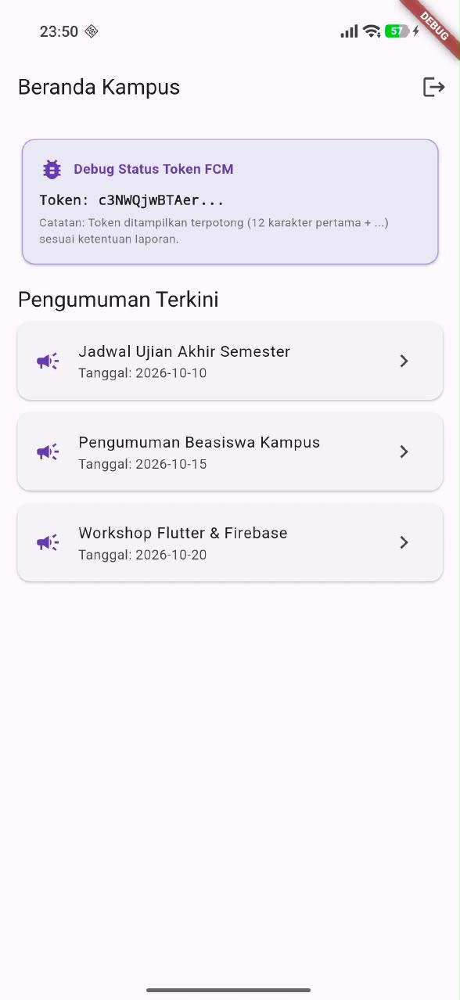
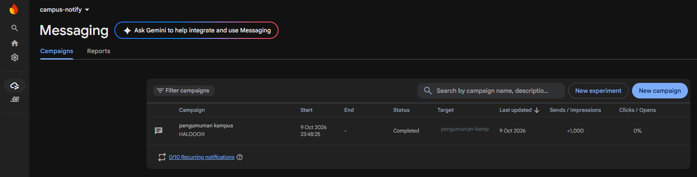

# Praktikum 2: FCM, permission, dan token lifecycle

- Tampilkan token di halaman Debug (terpotong, mis. 12 karakter pertama + ...)
 

- Hapus data aplikasi / reinstall, dan tunjukkan bahwa onTokenRefresh memperbarui token di backend
 

## 4. Uji kirim pertama dari Firebase Console
1. Buka Firebase Console -> Messaging -> buat campaign notifikasi percobaan.
2. Masukkan title dan body, targetkan aplikasi Android Anda.
 
3. Kirim saat aplikasi dalam state background: banner sistem harus muncul. Klik banner: aplikasi terbuka.
 
4. Catat hasilnya sebagai bukti screenshots/fcm-console-test.png.