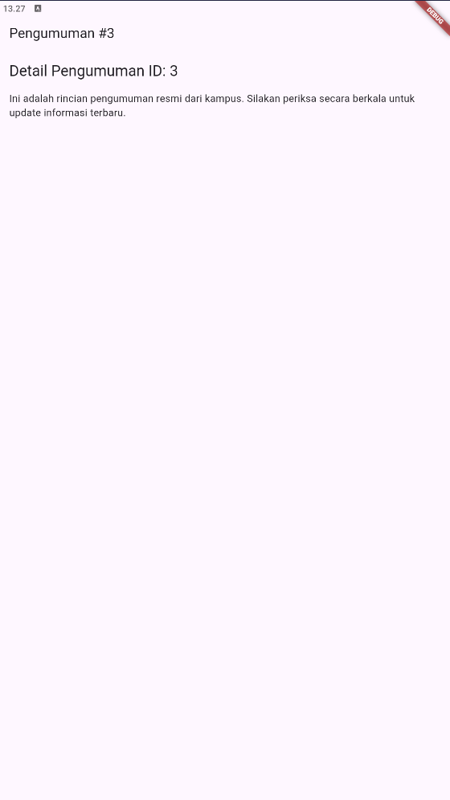
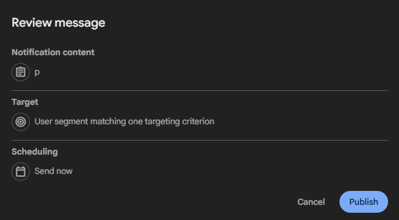
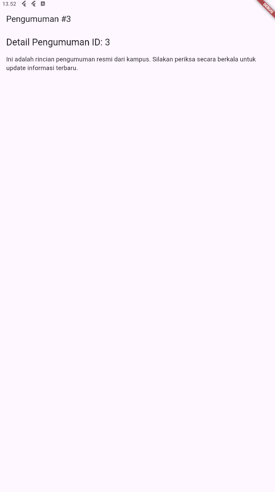
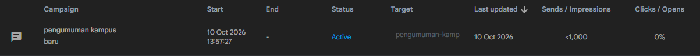

# Campus Notify - Push Notification & FCM

## Praktikum 2: FCM, Permission, & Token Lifecycle

### 1. Tampilan Token di Halaman Debug
Menampilkan FCM Device Token pada halaman Debug (ditampilkan secara terpotong, contoh: 12 karakter pertama + `...`):

   
  <b>Gambar 1:</b> Tampilan Token FCM pada Halaman Debug

 

### 2. Penanganan Refresh Token (`onTokenRefresh`)
Saat data aplikasi dihapus atau aplikasi di-reinstall, `onTokenRefresh` memicu pembaruan token baru dan mengirimkannya ke backend:

   
  <b>Gambar 2:</b> Pembaruan Token saat Reinstall / Refresh Token

 

### 3. Uji Kirim Pertama dari Firebase Console

1. Buka **Firebase Console** &rarr; **Messaging** &rarr; Buat campaign notifikasi percobaan.
2. Masukkan **Title** dan **Body**, lalu targetkan ke aplikasi Android.

   
  <b>Gambar 3:</b> Konfigurasi Campaign Notifikasi di Firebase Console

 

3. Kirim notifikasi saat aplikasi dalam state **Background**. Banner sistem akan muncul, dan saat diklik, aplikasi akan terbuka:

   
  <b>Gambar 4:</b> Banner Sistem Notifikasi FCM (Background State)

---

## Praktikum 3: Payload, App States, & Routing

### Matriks Pengujian Wajib

Berikut adalah hasil pengujian penerimaan notifikasi berdasarkan 3 kondisi/state aplikasi:

| App State | Screenshot | Hasil Observasi & Action |
| :--- | :---: | :--- |
| **Foreground** |  | Banner lokal muncul saat app aktif. Saat banner diklik, pengguna langsung diarahkan ke rute `/pengumuman/3`. |
| **Background** |  | Banner sistem bawaan OS muncul. Saat banner diklik, aplikasi terbuka dan berpindah ke rute yang sesuai. |
| **Terminated** |  | Banner sistem muncul saat aplikasi ditutup total. Klik banner membuka aplikasi ke rute tujuan melalui handler `getInitialMessage`. |

### Topic Messaging

Pengujian berlangganan topik (*Topic Subscription*) `pengumuman-kampus`:

   
  <b>Gambar 5:</b> Penerimaan Notifikasi berdasarkan Topic Subscription

---

## 6. AI Challenge

Proses pembuatan draf awal `PushService` dan verifikasi perilakunya dikoleksi dan didokumentasikan di folder [`docs/`](docs/):

- 📄 [AI Challenge - Prompt](docs/ai-challenge-prompt.md)
- 📄 [AI Challenge - Output Awal AI](docs/ai-challenge-initial-output.md)
- 📄 [AI Verification Checklist & Keputusan Teknis](docs/ai-verification.md)

### Ringkasan Temuan & Keputusan Teknis

1. **Background Handler Top-Level**: Dideklarasikan sebagai fungsi *top-level* di luar class dengan `@pragma('vm:entry-point')` untuk mendukung isolasi proses background Android/iOS.
2. **`onTokenRefresh` Backend Integration**: Memastikan token FCM baru dikirim ke `POST /devices` via HTTP request, bukan sekadar di-log ke console.
3. **Pemberitahuan Local Foreground**: Menggunakan `flutter_local_notifications` manual di `onMessage` agar banner Heads-up melayang dapat tampil saat aplikasi aktif.
4. **Navigasi Safe-Context**: Menghindari pemanggilan `BuildContext` pada listener async/background. Menggunakan fungsi callback rute global yang dihubungkan dengan router (`go_router`).
5. **Perbedaan Android 13+ vs iOS**: 
   - **Android 13+**: Memerlukan izin `POST_NOTIFICATIONS` runtime dan penyiapan `AndroidNotificationChannel` dengan `Importance.max`.
   - **iOS**: Memerlukan konfigurasi APNs, izin `requestPermission` alert/badge/sound, dan penyesuaian presentation options.
